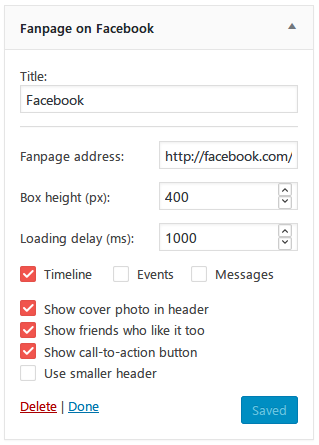

*YAFookPageBox* — Yet Another FacebOOK Page Plugin
===

Simple WordPress plugin, which provides sidebar widget with Facebook Page Plugin box. It's based on a standalone PHP class used to generate widget source code, which is reusable in different projects.

* Any external scripts or stylesheets aren't included to the webpage. Instead, simple `<iframe>` is used.
* Width of `<iframe>` is automatically calculated to fit horizontal free space.
* Small inline script is generated to reload `<iframe>`'s content when the window is resized. Without it, widget isn't responsive.
* It's possible to delay `<iframe>`'s loading. Useful for example when Facebook widget is placed at the bottom of the page.

Widget
---



You can manage all options provided by [Facebook Page Plugin](https://developers.facebook.com/docs/plugins/page-plugin) inside widget settings. They are translatable — pull requests for new languages welcome.

There are also hooks for developers:

* `yafook_before_render` and `yafook_after_render` actions are fired before and after widget's code rendering.
* `yafook_css_class` filter may be used to change CSS class of widget's main container.

`FacebookPageBox` class
---

It's possible to use code generator class directly. There is no documentation — just read the code, it's simple.

```
<?php
use YAFookPageBox\FacebookPageBox;

$FB = new FacebookPageBox;

// Set fanpage URL here.
$FB->setFanpageURL('http://facebook.com/facebook');

// Define visible tabs.
$FB->setShownTabs(
	FacebookPageBox::TAB_TIMELINE | FacebookPageBox::TAB_EVENTS | FacebookPageBox::TAB_MESSAGES
	// or: FacebookPageBox::TAB_TIMELINE | FacebookPageBox::TAB_MESSAGES
	// or: FacebookPageBox::TAB_NONE
);

// Set other Facebook widget settings.
$FB->setHeight(350);
$FB->setShowCover(false);
$FB->setShowFriends(true);
$FB->setShowCTA(true);
$FB->setSmallHeader(true);

// Set source code settings.
$FB->setLoadingDelay(1500);
$FB->setCSSClass('facebook-page');

// Output widget code.
echo $FB;  // or: $FB->render();
```